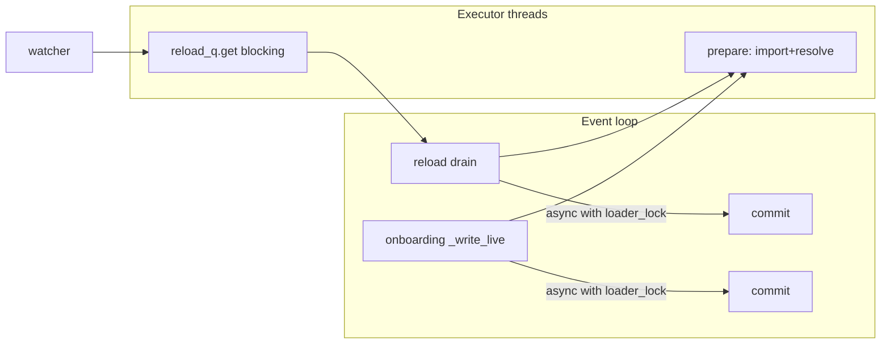

# 04 — App Assembly & Hot-Reload (`plugins/app.py`, `plugins/watcher.py`, `plugins/notifications.py`)

**Job:** wire the plugins into one ASGI app, run the initial load and the
hot-reload loop as background work inside the ASGI lifespan, and keep imports
off the event loop.

## `build_app` — the composition root

Everything is constructed here and stashed on `app.state` so route handlers
(which only get a `request`) can reach it.

```python
def build_app(ctx):
    mcp, jwt_verifier = build_mcp(ctx)                      # doc 02
    verifier = ToolVerifier(ctx.tools_dir, ...)            # doc 03
    loader = ToolLoader(mcp, ctx.tools_dir, verifier=verifier,
                        wrap_execution=ctx.metrics_enabled, sandbox=ctx.sandbox, ...)
    reload_q = queue.Queue()
    watcher = ToolDirectoryWatcher(reload_q, ctx.tools_dir)
    loader_lock = asyncio.Lock()                            # shared: drain ↔ onboarding
    onboarding = OnboardingManager(ctx.tools_dir, ..., loader_lock=loader_lock)

    app = mcp.http_app(transport="sse")
    if ctx.auth_type == "api_key":
        app.add_middleware(ApiKeyMiddleware, header=ctx.api_key_header, value=ctx.api_key_value)
    for route in feature_routes():
        app.router.routes.append(route)

    app.state.ready = False
    app.state.loader = loader
    app.state.onboarding = onboarding
    app.state.auth_type = ctx.auth_type or "none"
    app.state.admin_token = ctx.admin_token
    app.state.jwt_verifier = jwt_verifier
    register_metrics(loader, app)                           # doc 05
    ...
```

## Choosing the MCP transport

`MCP_TRANSPORT` selects how MCP clients speak to the server. The custom REST
routes (`/status`, `/tools/{name}/call`, `/admin/*`, …) are plain HTTP and exist
regardless — only the *protocol* endpoint changes.

```python
transport = ctx.mcp_transport
if transport == "sse":
    app = mcp.http_app(transport="sse")              # legacy: /sse + /messages
    protocol_prefixes = ("/sse", "/messages")
else:
    app = mcp.http_app(transport=transport, stateless_http=ctx.mcp_stateless)   # /mcp
    protocol_prefixes = ("/mcp",)
```

| `MCP_TRANSPORT` | Endpoint(s) | When |
|-----------------|-------------|------|
| `http` (default) | `/mcp` (Streamable HTTP) | current MCP standard; single endpoint, proxy/LB-friendly, `MCP_STATELESS_HTTP=true` for horizontal scaling |
| `sse` | `/sse` + `/messages` | legacy clients that require SSE (deprecated in the MCP spec) |

`protocol_prefixes` is what the api-key middleware guards (doc 02), so the right
endpoint is protected for whichever transport is active. `/status` reports the
live `transport`.

## The lifespan: readiness split + background worker

FastMCP's `http_app` already has a lifespan (its session manager). We **wrap**
it so ours runs *and* FastMCP's stays alive. The initial tool load runs as a
background task so the server accepts connections immediately: `/healthz` is
live at once, `/readyz` returns `503` until the load finishes, then `200`.
A blue-green deploy can wait on `/readyz == 200` before routing traffic.

```python
@contextlib.asynccontextmanager
async def lifespan(app_):
    loop = asyncio.get_running_loop()

    async def _bootstrap():
        await initial_load(loader, ctx.import_timeout)      # imports off-loop
        app_.state.ready = True                             # flips /readyz to 200
        await _reload_drain(loader, reload_q, mcp, ctx.import_timeout, loader_lock)

    worker = loop.create_task(_bootstrap())
    watcher.start()
    try:
        async with original_lifespan(app_):                 # keep FastMCP alive
            yield
    finally:
        reload_q.put(None)                                  # stop the drain
        watcher.stop()
        worker.cancel()
        with contextlib.suppress(asyncio.CancelledError, Exception):
            await worker
```

> **Why load-then-drain in one task?** The initial load and the reload drain
> run sequentially in the *same* task, so there's no race on the registry
> between "load everything" and "apply the first change".

## Keeping imports off the event loop

`prepare_with_timeout` runs the slow `prepare()` (import + resolve) in a thread
executor, bounded by `import_timeout`. A hostile tool whose top-level code sleeps
forever cannot freeze the server — the import is abandoned on timeout.

```python
async def prepare_with_timeout(loader, path, timeout):
    loop = asyncio.get_running_loop()
    try:
        return await asyncio.wait_for(loop.run_in_executor(None, loader.prepare, path), timeout=timeout)
    except asyncio.TimeoutError:
        log.error("Import of %s exceeded %ss; skipping ...", path, timeout)
        return None
```

`initial_load` yields between files so probes stay responsive during startup:

```python
async def initial_load(loader, import_timeout):
    for py in sorted(loader.tools_dir.glob("*.py")):
        if py.name == "__init__.py":
            continue
        plan = await prepare_with_timeout(loader, py, import_timeout)
        loader.commit(plan)          # on-loop, fast
```

## The filesystem watcher (`watcher.py`)

The only source of hot-reload (no remote poller). It does **not** load anything
itself — it just enqueues `(action, path)` events for the drain. Keeping the
watcher dumb means all registry mutations happen in one place.

```python
class ToolDirectoryWatcher(FileSystemEventHandler):
    def _emit(self, src_path, action):
        p = Path(src_path)
        if p.suffix == ".py" and p.name != "__init__.py":
            self.q.put((action, str(p)))

    def on_created(self, event):   self._emit(event.src_path, "load")
    def on_modified(self, event):  self._emit(event.src_path, "load")
    def on_deleted(self, event):   self._emit(event.src_path, "unload")
```

## The reload drain

Pulls events off the queue, imports off-loop, commits on-loop. The
`loader_lock` is the key detail: onboarding *also* imports tool modules in
executor threads, and two concurrent imports of the same module race
`importlib` (a real `KeyError`). The shared lock makes drain and onboarding
mutually exclusive.

```python
async def _reload_drain(loader, reload_q, mcp, import_timeout, loader_lock):
    loop = asyncio.get_running_loop()
    while True:
        item = await loop.run_in_executor(None, reload_q.get)
        if item is None:
            return                                   # shutdown sentinel
        action, path = item
        async with loader_lock:                      # ↔ onboarding
            if action == "unload":
                loader.unload_path(Path(path))
            else:
                plan = await prepare_with_timeout(loader, Path(path), import_timeout)
                loader.commit(plan)
        if loader.pop_changed():
            await notify_tools_changed(mcp)
```

## Client notifications (`notifications.py`)

On a change we make a best-effort push of `notifications/tools/list_changed` so
connected clients re-list. FastMCP exposes no public session registry, so this
probes known internals and degrades to a no-op (clients still see changes on
their next `list_tools`).

```python
async def notify_tools_changed(mcp):
    try:
        sessions = _discover_sessions(mcp)          # probes _session_manager etc.
        for sess in sessions:
            send = getattr(sess, "send_tool_list_changed", None)
            if send:
                with contextlib.suppress(Exception):
                    await send()
    except Exception as exc:
        log.debug("tools/list_changed notify skipped: %s", exc)
```

## Concurrency model, in one picture



Two locks total:
- **`loader_lock`** (in `app.py`, shared) — serializes *imports/commits* between
  the drain and onboarding.
- **`_install_lock`** (in onboarding) — serializes *pip subprocesses* between
  concurrent onboards (doc 07).
