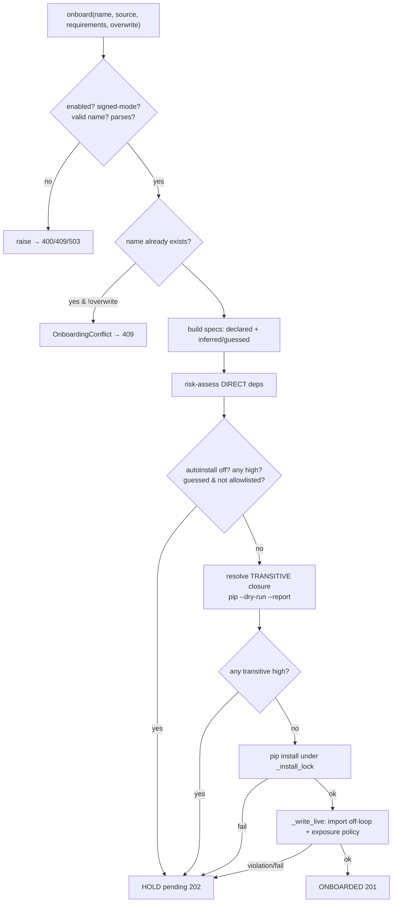

# 07 — Tool Onboarding (`plugins/onboarding.py`)

**Job:** accept a tool (source + pip deps) over HTTP, risk-gate it, install
what's safe, and hot-load it — or hold it pending for an admin. This is the
replacement for the removed Azure sync, and the most security-sensitive
component: it runs submitted code and pip in the server's own environment.

Everything is admin-gated (`MCP_ADMIN_TOKEN`, doc 02). The `OnboardingManager`
owns the pending store and the flow.

## The flow at a glance



## Step 1 — validate, signed-mode, conflict

```python
if not self.enabled:
    raise ValueError("tool onboarding is disabled ...")            # → 503 at the route
if self.loader.verifier is not None and getattr(self.loader.verifier, "require", False):
    raise ValueError("tool onboarding is unavailable while signed tools are required ...")  # → 400
if not _NAME_RE.match(name or ""):                                  # ^[A-Za-z_][A-Za-z0-9_]{0,63}$
    raise ValueError("invalid tool name ...")
ast.parse(source)                                                   # parse only, never exec here
if not overwrite:
    if (self.tools_dir / f"{name}.py").exists() or self.get_pending(name) is not None:
        raise OnboardingConflict(...)                               # → 409
```

Signed-tools mode and onboarding are mutually exclusive by design: an onboarded
file could never be in the trusted manifest, so we reject up front instead of
silently holding everything.

## Step 2 — build & assess direct dependencies

`_build_specs` merges declared `requirements` with imports detected in the
source, tagging each `declared` / `inferred` / `guessed`, deduping by canonical
name (so declared `python_dotenv` and inferred `import dotenv` are one package).

```python
def _build_specs(self, source, requirements):
    out = [(s, "declared") for s in (requirements or [])]
    covered = {risk.spec_name(s) for s in (requirements or [])}
    for mod in risk.detect_missing_imports(source):
        package, origin = risk.classify_import(mod)
        if risk.canonical_name(package) not in covered:
            out.append((package, origin)); covered.add(risk.canonical_name(package))
    return out
```

Three hold conditions on the direct deps:

```python
if not self.autoinstall and needs_install:
    return self._hold(..., "auto-install of new dependencies is disabled ...")
if any(not r.valid or r.level == "high" for r in reports):
    return self._hold(..., "one or more dependencies were assessed as high risk")
if guessed:            # guessed import name, not allowlisted
    return self._hold(..., "a dependency name was guessed from an import ...")
```

## Step 3 — transitive closure (supply-chain gate)

A low-risk top-level package can pull a malicious transitive dep. Before
installing, we resolve the *full* closure with pip's dry-run report and
risk-assess every transitively-pulled package. Network-gated.

```python
if self.network_check and install_specs:
    async with self._install_lock:
        ok, closure = await _pip_resolve_closure(install_specs, self.install_timeout, self.only_binary)
    if not ok:
        return self._hold(..., f"could not resolve dependency closure: {closure}")
    transitive = [self._assess_one(f"{p['name']}=={p['version']}", "transitive")
                  for p in closure if not p["requested"] and p["name"]]
    record["closure_reports"] = [asdict(r) for r in transitive]
    if [r for r in transitive if not r.valid or r.level == "high"]:
        return self._hold(..., "a transitive dependency was assessed as high risk: ...")
```

`_pip_resolve_closure` runs `pip install --dry-run --report -` and parses the
JSON (`requested=True` = direct, `False` = transitive). Same no-shell,
already-validated-specs discipline as the real install.

## Step 4 — install (serialized) and load

pip runs via `create_subprocess_exec` (never a shell), guarded by
`_install_lock` so concurrent onboards don't run pip against the same env.
`--only-binary :all:` (optional) stops pip from executing a package's
`setup.py`.

```python
async def _pip_install(specs, timeout, only_binary=False):
    proc = await asyncio.create_subprocess_exec(
        sys.executable, "-m", "pip", "install",
        "--no-input", "--disable-pip-version-check", "--quiet",
        *_only_binary_args(only_binary), *specs, ...)
    ...
    importlib.invalidate_caches()      # so the just-installed dist is importable now
    return True, ""
```

## Step 5 — `_write_live`: exposure policy + safe overwrite

The tool is imported **off the event loop** (bounded by `import_timeout`),
checked against the exposure policy **before** committing, and rolled back on
any failure. An overwrite that fails is **restored** to the previous working
version — a bad update never clobbers a running tool.

```python
async def _write_live(self, name, source):
    path = self.tools_dir / f"{name}.py"
    old_content = path.read_text() if path.exists() else None
    async with self.loader_lock:                       # ↔ reload drain (doc 04)
        path.write_text(source)
        registered, failure, manifest = await self._load_locked(module_name, path, enforce_policy=True)
        if failure or not registered:
            if old_content is not None:
                path.write_text(old_content)           # restore previous version
                await self._load_locked(module_name, path, enforce_policy=False)
            else:
                self.loader.unload_path(path); path.unlink(missing_ok=True)
    return registered, failure, manifest
```

`_load_locked` commits **only after** the policy passes:

```python
async def _load_locked(self, module_name, path, *, enforce_policy):
    self.loader.invalidate(module_name)
    plan = await prepare_with_timeout(self.loader, path, self.import_timeout)
    if plan is None:  return [], f"import did not complete within {self.import_timeout}s", {}
    manifest = self._build_manifest(plan)
    if plan.failure:  return [], plan.failure, manifest
    if enforce_policy and (violation := self._exposure_violation(plan)):
        return [], violation, manifest                 # do NOT register
    self.loader.commit(plan)
    return (*self.loader.module_outcome(module_name), manifest)
```

## The exposure policy (explicit opt-in)

Over-the-wire code shouldn't expose a function as a callable tool by filename
coincidence. So the legacy filename-match fallback is rejected for onboarding;
tools must opt in with `@tool` / `TOOLS` / `register`. Uses the
`ResolutionReport` from doc 03.

```python
def _exposure_violation(self, plan):
    rep = getattr(plan, "resolution", None)
    if not plan.resolved:
        seen = ", ".join(rep.functions_seen) if rep and rep.functions_seen else "(none)"
        return ("no function is exposed as a tool -- mark your entry point with @tool(...), "
                f"export TOOLS=[...], or define register(mcp). Functions found: {seen}")
    if self.require_explicit and rep is not None and rep.mechanism == "legacy":
        return (f"tool {plan.resolved[0][0]!r} is exposed only by the legacy filename-match "
                "convention; onboarded tools must opt in explicitly ...")
    if self.max_tools and len(plan.resolved) > self.max_tools:
        return f"file exposes {len(plan.resolved)} tools, exceeding the limit of {self.max_tools}"
    return None
```

## The tool manifest (preview)

Every record carries a `tool_manifest` so a reviewer sees exactly what a file
exposes vs. keeps private — the answer to "1 tool + 2 helpers, what's exposed?"

```python
def _build_manifest(self, plan):
    rep = getattr(plan, "resolution", None)
    tools = [{"name": tname, "description": getattr(tool, "description", None),
              "mechanism": rep.mechanism, "parameters": self._tool_params(tool)}
             for tname, tool in plan.resolved]
    return {"mechanism": rep.mechanism, "tools": tools,
            "not_exposed": [{"function": fn, "reason": reason} for fn, reason in rep.excluded],
            "warnings": list(rep.warnings)}
```

## Pending store, approve, reject

Held submissions are stored as `{name}.py.pending` (**not** `.py`) so
unreviewed code under a `sys.path` dir isn't importable, plus a `.json` record.

```python
def _pending_paths(self, name):
    return self.pending_dir / f"{name}.py.pending", self.pending_dir / f"{name}.json"
```

- `approve(name)` — admin override of the **risk** decision: installs and loads
  regardless of score. It does **not** bypass the exposure policy or a genuine
  load failure (those need a source fix). Name is validated via `get_pending`.
- `reject(name)` — discards the submission.

Both increment `mcp_tool_onboards_total{result=...}` and append to the audit log.

## Audit trail

Append-only JSON lines per onboard/approve/reject. Best-effort — a write
failure never breaks onboarding. One shared admin token means it records
*what* happened, not *who*.

```python
def _audit(self, action, name, result, detail=""):
    if not self.audit_log_path: return
    entry = {"ts": time.time(), "action": action, "name": name, "result": result, "detail": detail}
    try:
        self.audit_log_path.parent.mkdir(parents=True, exist_ok=True)
        with open(self.audit_log_path, "a", encoding="utf-8") as fh:
            fh.write(json.dumps(entry) + "\n")
    except Exception as exc:
        log.error("Could not write onboarding audit entry: %s", exc)
```

## Request-size limits (at the route)

`_admin_tools_onboard` guards the body before/after buffering: `Content-Length`
pre-check, source ≤ 1 MiB (`413`), ≤ 50 requirements (`400`), and maps
`OnboardingConflict → 409`, `ValueError → 400`, disabled `→ 503`.

## Gotchas / design notes

- Importing the submitted module runs its top-level code (bounded by the import
  timeout). Runtime *calls* can additionally be sandboxed (`MCP_SANDBOX_TOOLS`,
  doc 08); onboarding does not sandbox imports.
- The exposure policy lives here (the untrusted boundary), never in the shared
  loader — the trusted local dir keeps legacy support.
- Full config table and examples: `MCP_TOOL_ONBOARDING.md`.
