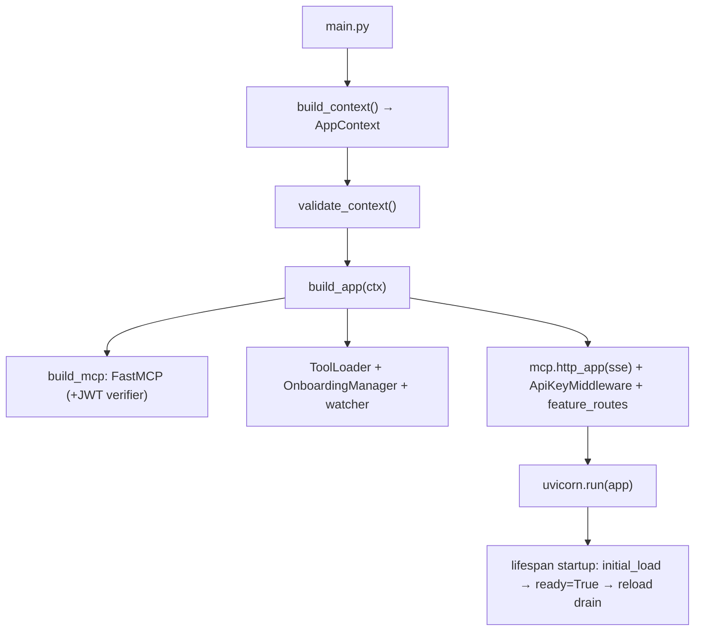

# Developer Guide — `src/main.py` plugin-based MCP tool server

A senior-engineer walkthrough of how the server is built, one functionality
per document, with code snippets and the *why* behind each decision. This
complements the operational guides (`MCP_MAIN_SERVER.md`,
`MCP_TOOL_ONBOARDING.md`, `MCP_SERVER_FEATURES.md`, `MCP_AUTH_GUIDE.md`) —
those tell you how to run and configure it; these tell you how it works inside.

## What this server is

`src/main.py` serves tools over MCP (SSE transport, via FastMCP) from a
**local** tools directory. There is no Azure or remote file share: tools live
on disk and arrive either as files in the watched directory or through the
**tool-onboarding HTTP API**. Every concern is a single-purpose module under
`src/plugins/`, wired together by `plugins/app.py`.

## Directory map

```
src/
├── main.py                 # thin entry point: parse → validate → build_app → uvicorn
├── tools_sdk.py            # @tool decorator — the authoring contract (doc 03)
├── metrics.py              # dependency-free Prometheus registry (doc 05)
├── tool_runner.py          # subprocess entry point for sandboxed calls (doc 08)
├── tools/                  # the live tools directory (hot-reloaded)
└── plugins/
    ├── config.py           # env + CLI → AppContext              (doc 01)
    ├── security.py         # auth: none | api_key | bearer_jwt   (doc 02)
    ├── signing.py          # signed-tool manifest verification   (doc 03)
    ├── tool_loader.py      # discover / resolve / register tools (doc 03)
    ├── watcher.py          # filesystem hot-reload                (doc 04)
    ├── notifications.py    # tools/list_changed push             (doc 04)
    ├── app.py              # ASGI assembly + lifespan + drain     (doc 04)
    ├── routes.py           # HTTP endpoints + metrics registration(doc 05)
    ├── dependency_risk.py  # pip-dependency risk scoring          (doc 06)
    ├── onboarding.py       # risk-gated tool onboarding           (doc 07)
    └── cli.py              # --validate / --sign                  (doc 08)
```

## The documents

| # | Doc | Covers |
|---|-----|--------|
| 01 | [Configuration](01-configuration.md) | `config.py`: env precedence, `AppContext`, safe `--config` paths |
| 02 | [Security & Auth](02-security-auth.md) | `security.py`: the three auth modes, admin token, constant-time checks |
| 03 | [Tool Loading](03-tool-loading.md) | `tools_sdk.py`, `tool_loader.py`, `signing.py`: authoring contract, resolution, fault isolation, signing |
| 04 | [App Assembly & Hot-Reload](04-app-and-hot-reload.md) | `app.py`, `watcher.py`, `notifications.py`: lifespan, prepare/commit split, the reload drain, locks |
| 05 | [HTTP API & Metrics](05-http-api-metrics.md) | `routes.py`, `metrics.py`: every endpoint, the metrics registry |
| 06 | [Dependency Risk](06-dependency-risk.md) | `dependency_risk.py`: scoring heuristics, PyPI lookup, canonicalization |
| 07 | [Tool Onboarding](07-tool-onboarding.md) | `onboarding.py`: the full flow, exposure policy, manifest, conflicts, audit |
| 08 | [CLI & Sandbox](08-cli-and-sandbox.md) | `cli.py`, `tool_runner.py`: validate/sign, subprocess sandbox |

## The one mental model to hold

Two rules explain most of the code:

1. **Imports are slow and dangerous; the registry mutation is fast and safe.**
   So every load is split into `prepare()` (import + resolve, runs *off* the
   event loop in a thread, bounded by a timeout) and `commit()` (add/remove on
   the FastMCP registry, runs *on* the event loop, cannot block). See doc 03/04.

2. **Anything that arrives over the wire is untrusted until proven otherwise.**
   Onboarding risk-scores dependencies, resolves the transitive closure,
   requires explicit tool opt-in, sandboxes optionally, and audits everything.
   See docs 06/07.

## Request lifecycle (high level)


